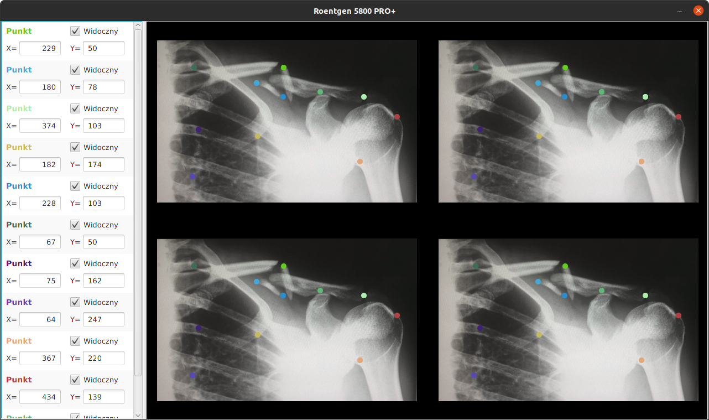

# Roentgen
Aplikacja wspomagająca pracę lekarzy radiologów.

## Technologie

* Java 8 Corretto
* JavaFX
* Maven 3.6.3

### Opcjonalne/Dodatkowe

* Określanie punktu względem obrazu.

* Walidacja pól tekstowych.

* Usunięcie punktu prawym przyciskiem myszy.

* Określanie widoczności punktu.

* Kolory generowane losowo.

#### Wykorzystany obraz
https://unsplash.com/photos/ouyjDk-KdfY